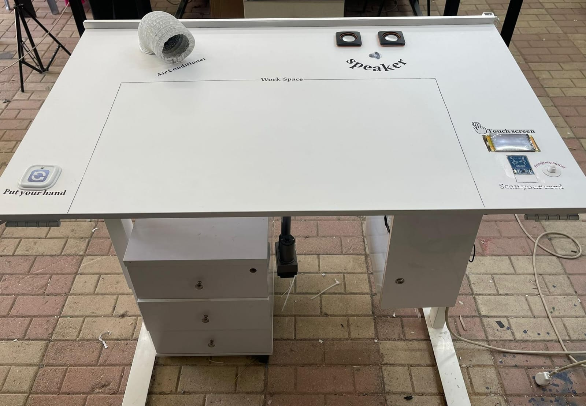

# SmartDesk

**SmartDesk** is a graduation project developed to create an intelligent, ergonomic, and adaptable workspace system. In response to the growing trends of remote work and the increasing focus on public health, this project aims to revolutionize traditional office furniture by integrating advanced technology to enhance user **comfort**, **productivity**, and **safety**.

The system addresses the limitations of conventional desks by offering **dynamic adjustments** and **smart environmental responses**, ensuring a highly customizable and healthy working environment.

## 🚀 Key Features

### 🔄 Height Adjustment System
- **HC-SR04 Ultrasonic Sensors** for precise distance measurement (2 cm to 4 meters, ±3 mm accuracy).
- **DC motor** for automatic height adjustment between sitting and standing modes.
- Manual or automatic control via **Nextion touch panel** or **hand gesture**.

### 📐 Angle Desk Tilt System
- **MPU6050 (6-axis)** sensor for angle detection and desk surface adjustment.
- Multiple angle modes (Laptop, Drawing, Writing, Reading).
- Actuated by a **24V satellite motor**.

### 🗄️ Integrated Storage Unit
- Three drawers using traditional rails and **NEMA17 stepper motors**.
- Controlled with **H-Bridge (L298N)** and **screw-drive mechanism**.
- Real-time status and drawer tracking via **Firebase**.

### 🌈 Dynamic Lighting System
- **RGB LED Strip** for visual notifications (e.g., login status, gas alerts).
- **LDR Sensor** for ambient light detection and auto-lighting.
- Brightness control through **Nextion display**.

### ❄️ Smart Air Conditioning
- **220V fan + Peltier module (TEC1-12706)** for localized heating/cooling.
- Controlled via **BMP280** temperature and pressure sensor.

### 🛑 Gas Detection & Alarm System
- **MQ-135 gas sensor** to detect harmful gases (e.g., NH₃, CO₂, benzene, smoke).
- Triggers **audio alert** and **blue flashing RGB light** on the desk.

### 🔐 RFID Authentication & Security
- **MFRC522 RFID Module (13.56 MHz)** for secure user identification.
- Visual and audio feedback: green light for success, red for invalid access.
- Personalized settings and login status synced to **Firebase**.

### 📱 Mobile Application
- Developed using **App Inventor**.
- Connected to **Firebase** for:
  - Viewing current desk settings.
  - Managing tasks and schedule.
  - Monitoring temperature and drawer contents.

### ⚠️ Emergency System
- A dedicated **emergency button**:
  - Logs out the user.
  - Shuts down all systems.
  - Triggers red light and audible alert.

## 🧠 System Architecture

### Microcontrollers
- **Arduino MEGA 2560**: Central controller managing sensors, motors, display, and logic.
- **ESP32 NodeMCU**: Wi-Fi/Bluetooth enabled; handles Firebase communication.

### Sensors
- HC-SR04 (height)
- MPU6050 (tilt angle)
- LDR (light)
- MQ-135 (gas detection)
- BMP280 (temperature and pressure)
- MFRC522 (RFID authentication)

### Actuators & Motors
- DC Motor (desk lift)
- Satellite Motor (angle tilt)
- NEMA17 Stepper Motors (drawers)
- L298N H-Bridge
- 8-channel relays
- Switch fan
- TEC1-12706 Peltier Module

### User Interface
- **Nextion Touch Display**
- **RGB LEDs**
- **MP3-TF-1CP with speaker** for voice alerts

### Cloud Integration
- **Firebase Realtime Database**:
  - Stores user profiles, desk settings, drawer logs.
  - Syncs data between ESP32 and mobile app.

## 🔄 Workflow Summary

1. **Login**:  
   User scans RFID → Voice greeting plays → Green flash if successful → Login logged in Firebase.

2. **Control Panel (Nextion)**:
   - **Save/Recover Settings** from Firebase.
   - **Logout** button resets desk for next user.
   - **Modes**: Select desk tilt or height.

3. **Desk Adjustment**:
   - **Height**: Sit/Stand buttons or hand gesture over ultrasonic sensor.
   - **Tilt**: Select angle mode (e.g., Writing, Drawing).

4. **Storage Drawers**:
   - Control open/close via display.
   - Voice + visual feedback (e.g., "Drawer Full", "Item Retrieved").
   - Actions logged to Firebase.

5. **Climate Control**:
   - Monitored by BMP280.
   - Activates **cooling** (>27.5°C) or **heating** (<25°C).

6. **Air Quality**:
   - Harmful gases detected by MQ-135.
   - Activates alarm sound and blue lights.

7. **Lighting**:
   - Auto-on in dark environments using LDR.
   - Manual override from display.

## 🧰 Installation and Setup

> ⚠️ This is a hardware-software integrated project. Below are software setup steps. Hardware assembly requires reference to the project report.

### ✅ Arduino MEGA Setup
- Install [Arduino IDE](https://www.arduino.cc/en/software)
- Install libraries for:
  - Ultrasonic, MPU6050, BMP280, MQ135, RFID, Nextion, etc.
- Upload `main.ino` to Arduino MEGA.

### ✅ ESP32 Setup
- Install ESP32 board via Arduino IDE Board Manager.
- Add Firebase credentials in the code.
- Upload Firebase sync code to ESP32.

### ✅ Nextion Display
- Design and export `.tft` file using **Nextion Editor**.
- Upload via SD card or USB-TTL adapter.

### ✅ Mobile App
- Developed in **MIT App Inventor**.
- Connects to the same Firebase project.
- Provides real-time status and control options.

## 👨‍🏫 Supervisors & Authors

### 👥 Authors
- [**Eman Abd Alaziz**](mailto:abdalazizeman9224@gmail.com)  
- [**Samya Hamed**](mailto:samyahamed22@gmail.com)

### 🎓 Supervisor
- **Dr. Emad Natsheh**

## 🙏 Acknowledgments
We extend our sincere gratitude to our supervisor **Dr. Emad Natsheh** for his continuous support and valuable insights throughout this project.

Thanks to the **Computer Engineering Department** at **An-Najah National University** for the technical foundation and encouragement.

